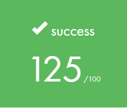

# Rainfall - Binary Exploitation Learning Project

## 📖 Project Overview

**Rainfall** is a progressive binary exploitation wargame designed to teach fundamental and advanced security concepts through hands-on practice. The project consists of 10 main levels plus 4 bonus challenges, each introducing different vulnerability classes and exploitation techniques.

Running on a controlled Linux x86 environment, Rainfall provides setuid binaries that must be exploited to escalate privileges and retrieve passwords for subsequent levels. Each challenge builds upon previous concepts while introducing new attack vectors and defensive mechanisms.

### Learning Objectives
- Master assembly language reading and debugging techniques
- Understand memory layout and stack/heap organization
- Identify and exploit common binary vulnerabilities
- Develop practical exploitation payloads
- Learn to bypass security mechanisms
- Build foundational skills for advanced binary exploitation

## 🎯 Challenge Progression

### Main Levels

| Level | Vulnerability Type | Key Concepts |
|-------|-------------------|--------------|
| **Level 0** | Logic bypass | Hardcoded authentication, reverse engineering basics |
| **Level 1** | Stack corruption | Buffer overflow, return-to-text, gets() vulnerability |
| **Level 2** | Protected stack | Heap exploitation, return address protection bypass |
| **Level 3** | Format string | Arbitrary memory write, %n format specifier |
| **Level 4** | Heap overflow | Buffer overflow on heap, memory corruption |
| **Level 5** | Heap overflow | Direct function pointer hijacking |
| **Level 6** | Heap overflow | Heap-based function pointer corruption |
| **Level 7** | Heap overflow | Multi-stage heap corruption, indirect GOT hijacking |
| **Level 8** | Heap positioning | Authentication logic bypass through heap manipulation |
| **Level 9** | Heap positioning | vtable pointer corruption, C++ object exploitation |

### Bonus Levels

| Level | Vulnerability Type | Key Concepts |
|-------|-------------------|--------------|
| **Bonus 0** | String operations | String operation chain exploitation, precise input crafting |
| **Bonus 1** | Integer overflow | Signed/unsigned conversion, arithmetic overflow, type confusion |
| **Bonus 2** | Environment variable exploitation | Locale-dependent buffer overflow, environment code injection, multi-vector attack |
| **Bonus 3** | Null byte injection | String truncation attack, authentication bypass, file-based exploitation |

## 🛠️ Technical Skills Developed

### Assembly & Debugging
- x86 assembly language comprehension
- GDB (GNU Debugger) proficiency
- Dynamic and static binary analysis
- Memory examination and manipulation

### Exploitation Techniques
- Buffer overflow exploitation (stack and heap)
- Return-oriented programming (ROP) basics
- Format string vulnerabilities
- Shellcode development and injection
- Return-to-libc attacks
- Heap exploitation techniques
- Function pointer hijacking
- GOT/PLT manipulation

### Security Concepts
- Memory layout (stack, heap, .bss, .data, .text)
- Calling conventions and ABI
- Security mechanisms (ASLR, NX, stack canaries)
- Privilege escalation via setuid binaries
- Protection bypass techniques

## 📚 Essential Resources

### Official Documentation
- **[Oracle Linker and Libraries Guide](https://docs.oracle.com/cd/E26502_01/html/E28388/eojde.html)** - Understanding ELF format, dynamic linking, and PLT/GOT
- **[OWASP Format String Attacks](https://owasp.org/www-community/attacks/Format_string_attack)** - Comprehensive format string vulnerability guide

### Exploitation Techniques
- **[Return-to-libc (ret2libc)](https://www.ired.team/offensive-security/code-injection-process-injection/binary-exploitation/return-to-libc-ret2libc)** - Detailed ret2libc attack methodology
- **[Shellcode Fundamentals](https://www.sentinelone.com/blog/malicious-input-how-hackers-use-shellcode/)** - Understanding and crafting shellcode
- **[De Bruijn Sequences](https://docs.pwntools.com/en/stable/util/cyclic.html)** - Pattern generation for offset discovery in buffer overflows
- **[x86 Assembly Guide](https://www.cs.virginia.edu/~evans/cs216/guides/x86.html)** - Essential x86 assembly reference for binary exploitation
- **[ROP Emporium](https://ropemporium.com/)** - Interactive tutorials for Return-Oriented Programming (ROP)

### Tools and Utilities
- **[pwntools Documentation](https://docs.pwntools.com/)** - Python exploitation framework for CTF challenges
- **[GDB PEDA](https://github.com/longld/peda)** - Python Exploit Development Assistance for GDB
- **[ROPgadget](https://github.com/JonathanSalwan/ROPgadget)** - Tool for finding ROP gadgets in binaries
- **[Shellcode Database](http://shell-storm.org/shellcode/)** - Collection of shellcodes for various architectures

### Security Concepts
- **[Stack Canaries Explained](https://ctf101.org/binary-exploitation/stack-canaries/)** - Understanding stack protection mechanisms
- **[ASLR and DEP Bypass Techniques](https://www.exploit-db.com/docs/english/17914-bypassing-aslrdep.pdf)** - Modern protection circumvention methods
- **[Integer Overflow Vulnerabilities](https://cwe.mitre.org/data/definitions/190.html)** - CWE guide to integer overflow attacks
- **[Format String Exploitation](https://cs155.stanford.edu/papers/formatstring-1.2.pdf)** - Academic paper on format string vulnerabilities

### Recommended Books
- **"Hacking: The Art of Exploitation" by Jon Erickson** - Excellent introduction to binary exploitation
- **"The Shellcoder's Handbook"** - Advanced exploitation techniques
- **"Practical Binary Analysis"** - Modern binary analysis methods

### Online Learning
- **LiveOverflow Binary Exploitation YouTube Series** - Visual explanations of exploitation concepts
- **Exploit Education (exploit.education)** - Similar progressive challenges
- **pwnable.kr** - Additional practice with varied difficulty levels
- **ROP Emporium** - Focused ROP technique practice

### Tools & References
- **GDB Tutorial** - Essential debugging skills
- **pwntools Documentation** - Python exploitation framework
- **x86 Assembly Reference** - Instruction set documentation
- **Linux Syscall Table** - System call reference for shellcode

## 🚀 Getting Started

### Prerequisites
- Basic C programming knowledge
- Linux command line familiarity
- Understanding of computer architecture concepts
- Patience and persistence

### Setup
1. Import the Rainfall ISO into your VM software
2. Boot the virtual machine
3. SSH into level0: `ssh level0@<IP_ADDRESS> -p 4242`
4. Default credentials: `level0:level0`

### Workflow
1. **Analyze** the binary using GDB and other tools
2. **Identify** the vulnerability through static/dynamic analysis
3. **Develop** an exploitation payload
4. **Test** the exploit in a controlled environment
5. **Document** your findings (source code, walkthrough, exploit)
6. **Retrieve** the password for the next level
7. **Escalate** to the next user and repeat

## 📁 Repository Structure

```
rainfall/
├── README.md
├── level0/
│   ├── flag
│   ├── source
│   └── walkthrough.md
├── level1/
│   ├── flag
│   ├── source
│   └── walkthrough.md
├── level2/
│   ├── flag
│   ├── source
│   └── walkthrough.md
[...]
├── bonus0/
│   ├── flag
│   ├── source
│   └── walkthrough.md
[...]
```

### Documentation Guidelines
- **flag**: Contains the password/flag for the level
- **source**: Reconstructed C source code (any language)
- **walkthrough.md**: Step-by-step solution process


---

## 📊 Project Results

### Grade


### Team
- **[zait-che]**
- **[fchanane]**

---

**Remember:** The goal is not just to complete the challenges, but to deeply understand the concepts. Take your time, experiment, and enjoy the learning journey!

*"In learning you will teach, and in teaching you will learn."* - Phil Collins